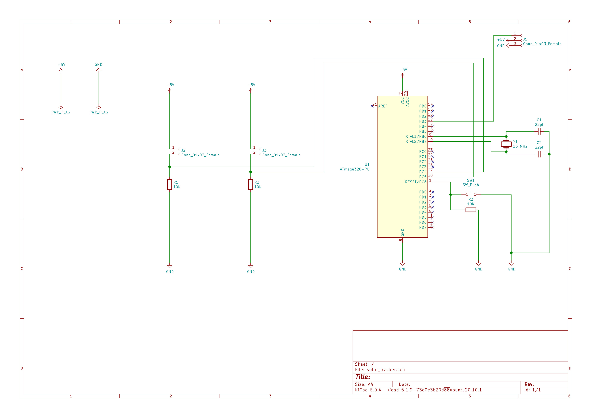
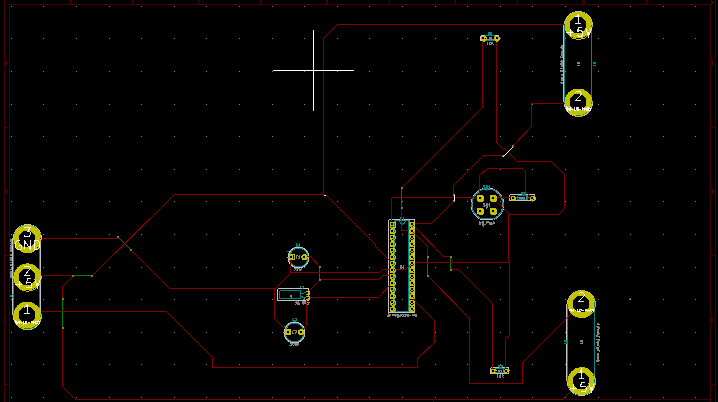

# sun-solar-tracker
Optimize absortion of sun's energy by use of light intensity measurements whose different values make a solar panel to rotate towards the direction of the sun.
The data from the solar tracker is sent to a through an ESP2266 module to the owner for them to know when the batterries being charged are full.

## Schematic

## PCB

### Working
The circuit uses two LDRs as inputs to ATMEGA328P. THe arduino compares the voltages and tilts the servo motor connected to one of the pins to the side that is receiving more sunlight. The program ensures that the solar panel is always oriented 90 degress towards the sun for optimum photovoltaic generation ef energy.
